

 

<h1 style=" font-weight: bold;"
    Tela inicial: align="center" >
    <a  href="https://calcbeam.github.io/">CalcBeam</a>
</h1>
<h3 align="center" >O <a href="https://calcbeam.github.io">CalcBeam</a> é fruto de um TCC de um graduando em engenharia civil, uma aplicação client side que tem o 
objetivo de fazer cálculos de dimensionamento de uma viga com dente Gerber. A utilização e desenvolvimento da ferramenta está centralizado na facilitação do ensino para discentes de Engenharia Civil. </h3>
 
<table align="center">
<tr align="center">
    <td>Projetado por:</td>
    <td>Desenvolvido por:</td>
    
</tr>
  
<tr align="center">
<td></td>
<td></td>

</tr>
<tr align="center">
<td ><a align="center" href="https://gabrielbtera.github.io"><b> Bruno Figueiredo </b> </a></td>
    <td><a align="center" href="https://gabrielbtera.github.io"><b> Gabriel Silva </b> </a></td>
    
</tr>
 </table>
 

 

<h2 align="initial"> <li>Tecnologias usadas:</li>
</h2>

<ul align="initial">

  <li>JavaScript</li>
<li>Html </li>
  <li>CSS</li>
  <li>Python</li>
</ul>

<h4>
A ideia inicial era criar uma aplicação em python que fosse executável em um SO desktop windows e assim,
<a align="center" href="https://gabrielbtera.github.io"><b> Bruno Figueiredo </b> </a> começou a fazer. Só que após Bruno me  procurar, <a align="center" href="https://gabrielbtera.github.io"><b> eu </b> </a> sugeri que fossem implemantadas páginas web responsivas, assim sendo utilizadas em qualquer aparelho que tenha um navegador. Foi percebido que a aplicação poderia ser rodada 100% no cliente, sem necessidade de um back-end e um banco de dados. O código python que estava rodando com um menu improvisado no terminal foi traduzido para a linguangem JavaScript e conectado às páginas Html.
</h4>
 

### **Tela inicial:**
* Desktop:

  * 

 

* Celular:

  * 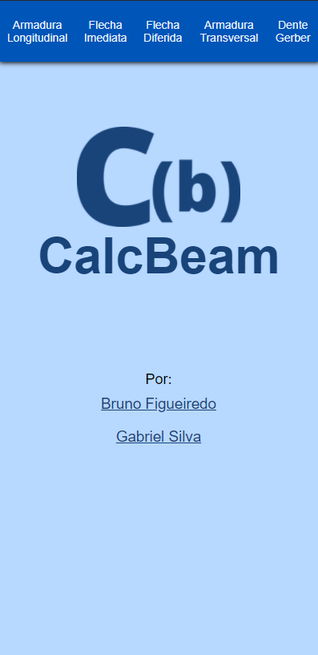

 

### **1 - Armadura longitudinal:**
* Desktop:

  * 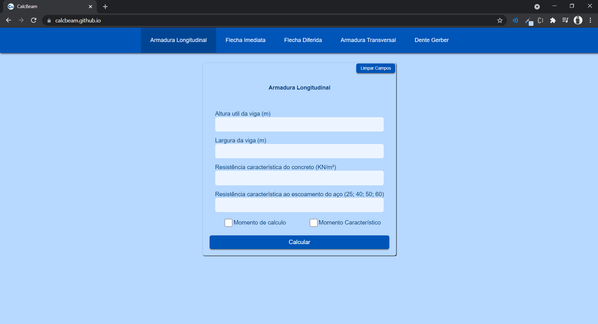

 

* Celular:

  * 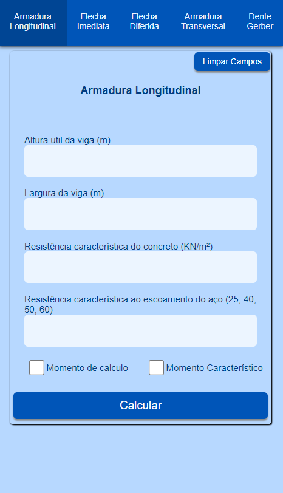

### **2 - Flecha Diferida:**
* Desktop:

  * 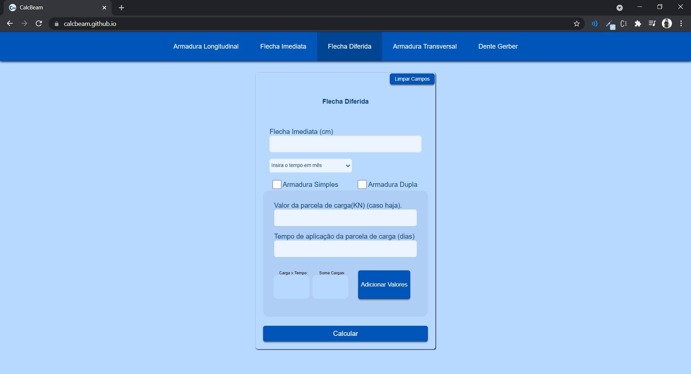

 

* Celular:

  * 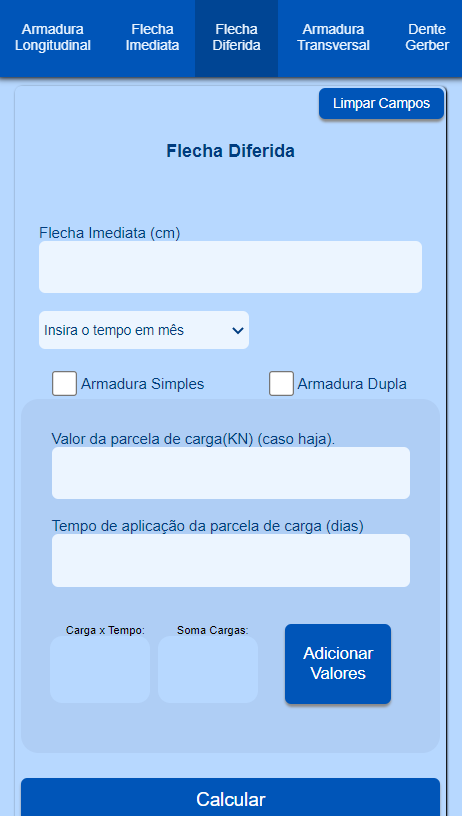

#### Estes são alguns prints das telas ao todo são 5 opções. Não vem ao caso exibir todas aqui. A seguir alguns warnings da aplicação.

 

### **3 - Warnings da aplicação:**

* Aviso de campos vazios:
  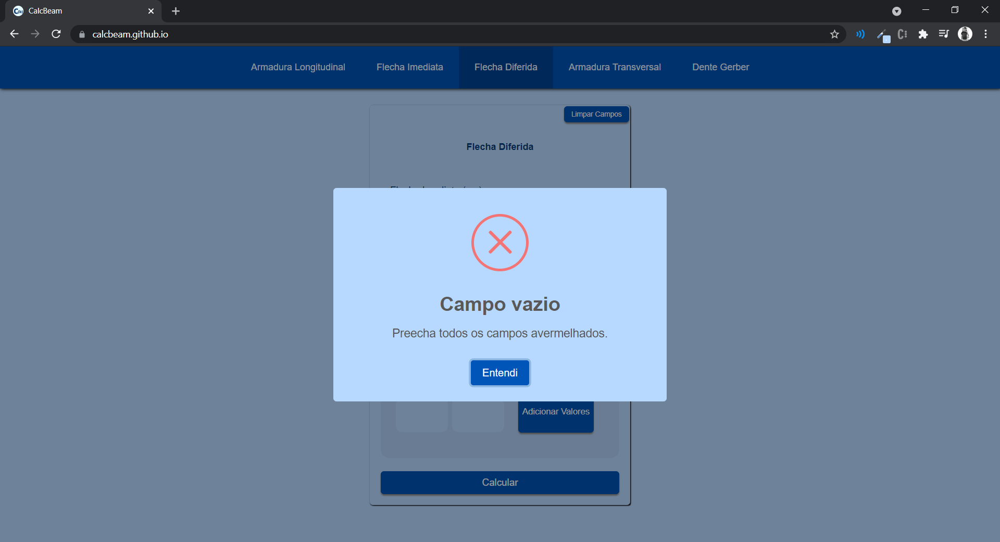
   
   
* Mostrar quais componentes preencher:
  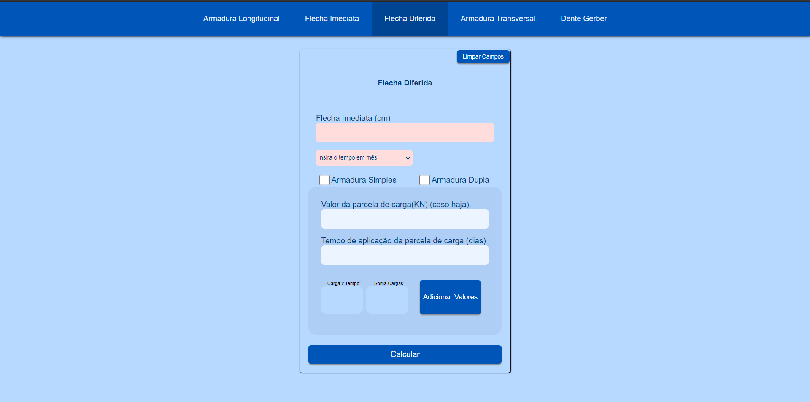

 

* ÂNGULOS INVÁLIDOS:
   
  * 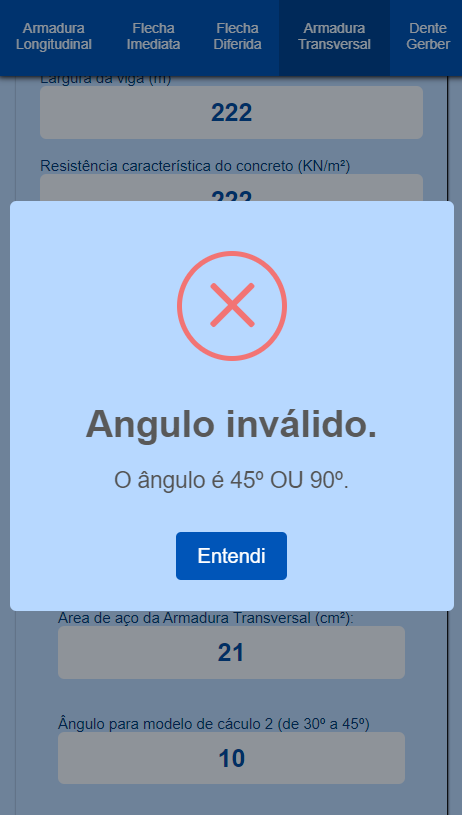

* Dados Inválidos(caracteres que não são numeros):
   
  * 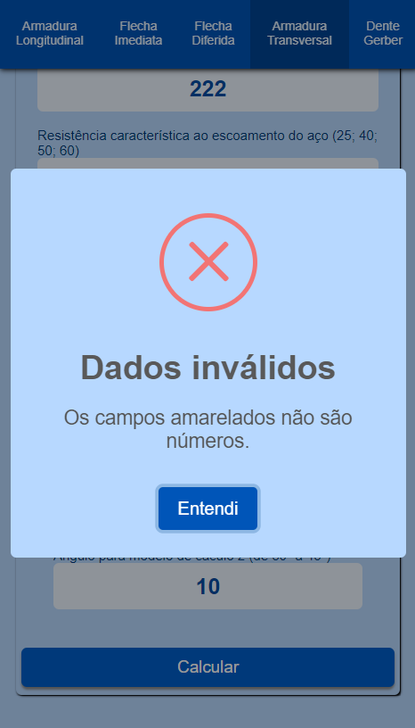

* Exibir onde estão o caracteres:
   
  * 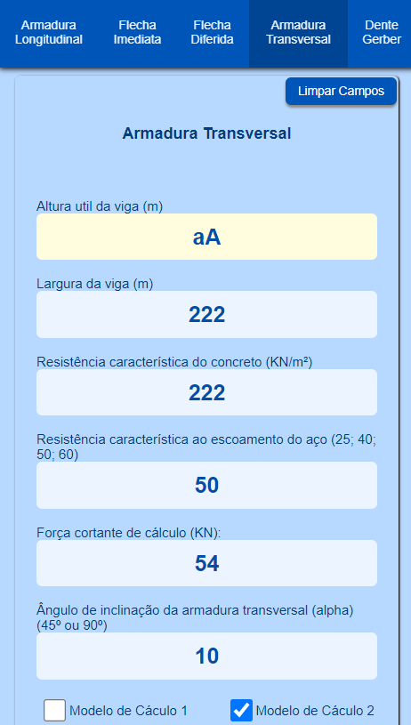

* Marcar check box:
   
  * 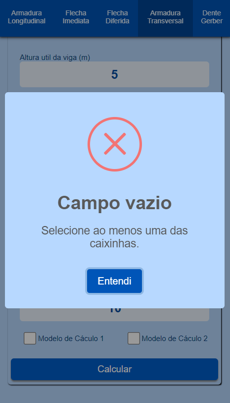

### **4 -Resultados dos Calculos:**

 

* Resultados dos cálculos:
   
  * 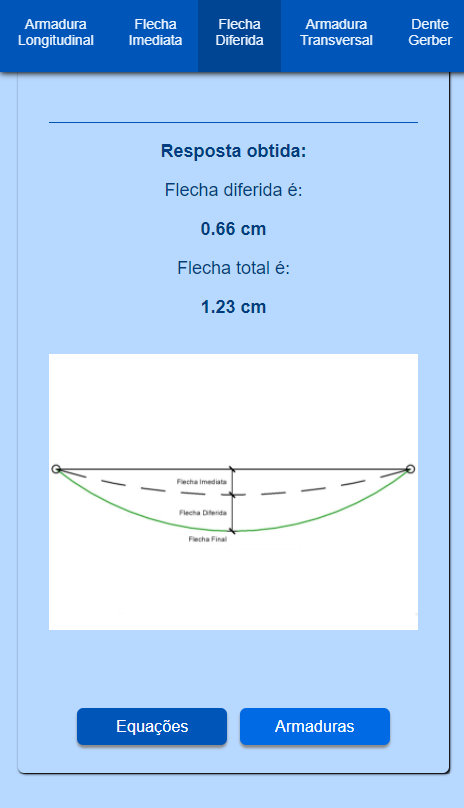

 

* Resultados dos cálculos mobile:
   
  * 

 

* Resultados dos cálculos desktop:
  * 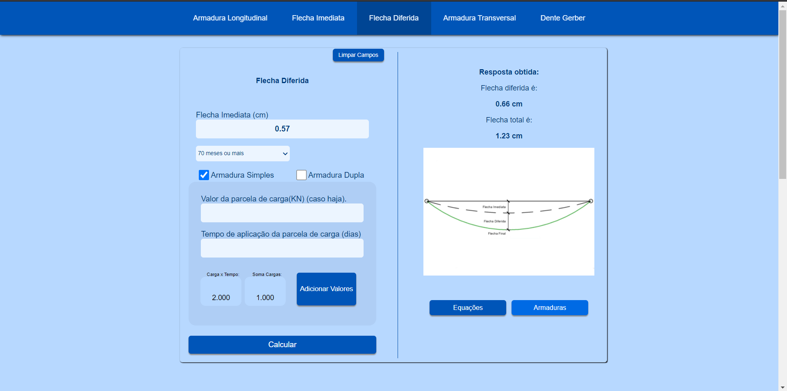

 

* Equações:
  * 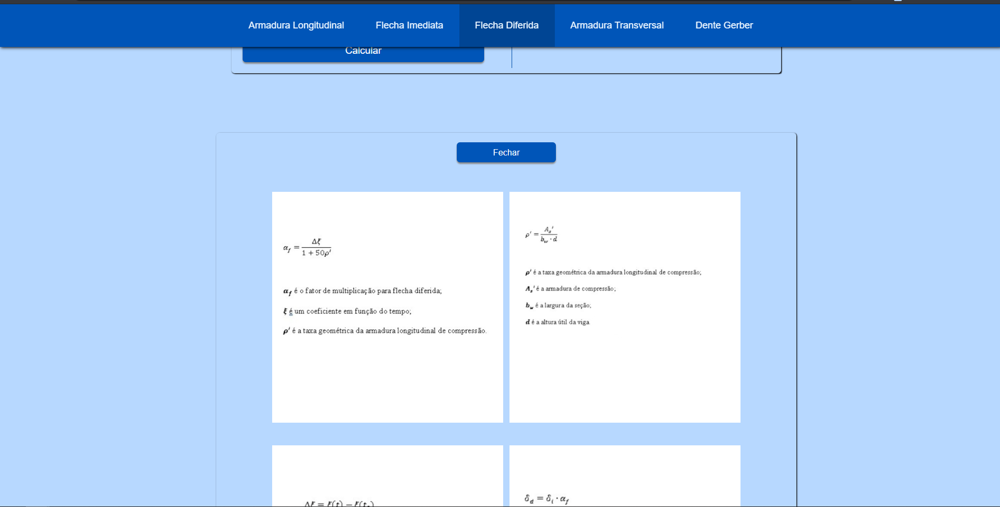

 

* Armaduras:
    * 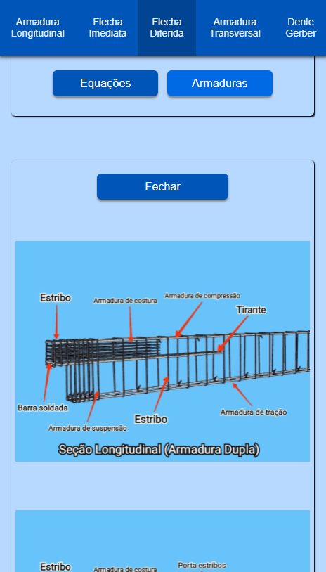

### Na seção 4, todos os resultados de saídas estão no mesmo padrão para todas as opções.

 
<h3 style=" font-weight: bold;"
    Tela inicial: align="center" >
    Visite o <a  href="https://calcbeam.github.io/">CalcBeam 💙💙💙</a>.

</h3>